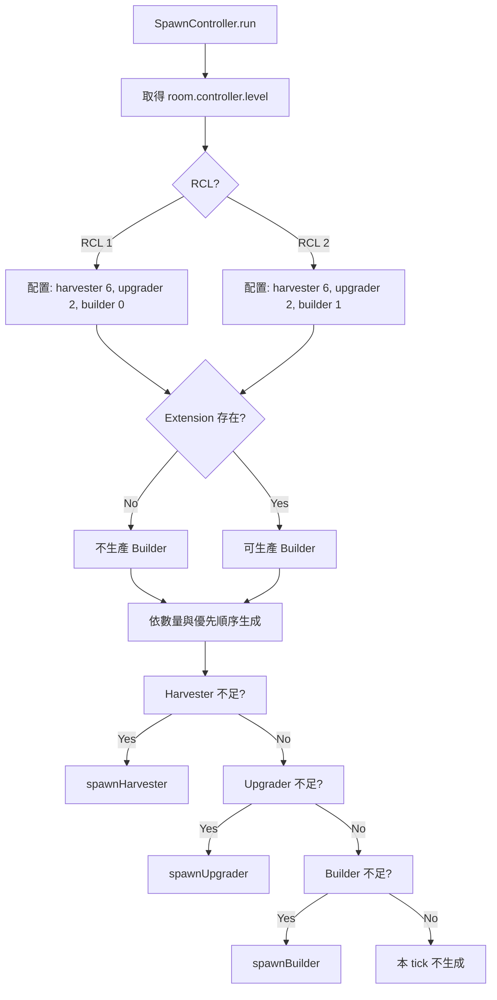
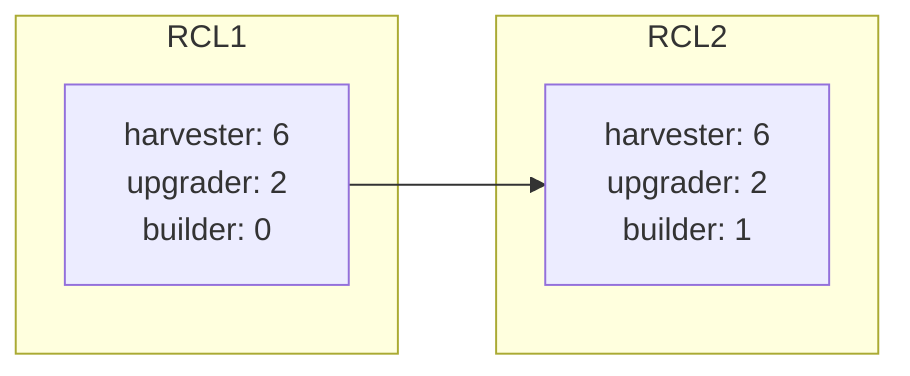

# PRD: Creep 等級與 RCL、Spawn 數量調整

**Document Version:** 1.0  
**Date:** 2026-03-10  
**Status:** Draft

---

## 1. 目標與願景

### 目標

- **Creep 等級系統**：Creep 新增等級概念，對應 Room Controller Level (RCL)
- **RCL 進階機制**：當 RCL 升級時，Creep 的生成與行為可進階至下一階段
- **RCL ≤ 2 數量調整**：Harvester 6 個、Upgrader 2 個、Builder 1 個（Extension 出現後才生產 Builder）

### 願景

- 建立 RCL 驅動的 Creep 配置系統，為後續 RCL 3+ 擴充奠定基礎
- 與現有 SpawnController、CreepController 整合，保持架構一致性

---

## 2. 功能詳述

### 2.1 Creep 等級與 RCL 對應

| 項目 | 說明 |
|------|------|
| 等級來源 | Room Controller 的 `controller.level` (RCL 1~8) |
| 對應關係 | Creep 的生成配置、Body、角色比例依 RCL 變化 |
| 進階時機 | RCL 升級後，新生成的 Creep 使用新階段配置 |

> **注意**：現有 Creep 不會自動「進階」，僅新生成的 Creep 會採用新 RCL 對應的配置。

### 2.2 RCL ≤ 2 的 Spawn 數量

| 角色 | 數量 | 備註 |
|------|------|------|
| Harvester | 6 | 對應現有 Miner 角色，採集能量並傳遞至 Spawn |
| Upgrader | 2 | 升級 Room Controller |
| Builder | 1 | **僅在地圖上出現 Extension 之後**才開始生產 |

### 2.3 SpawnController 調整

| 項目 | 說明 |
|------|------|
| 職責擴充 | 依 RCL 讀取對應的 Creep 數量配置 |
| 總 Creep 上限 | RCL ≤ 2 時：6 + 2 + 1 = 9（可依實際需求調整） |
| Builder 生產條件 | `room.find(FIND_MY_STRUCTURES, { filter: { structureType: STRUCTURE_EXTENSION } }).length > 0` |
| 生成優先順序 | Harvester > Upgrader > Builder |

### 2.4 CreepRole 擴充

- 新增 `BUILDER` 至 `CreepRole` enum
- `CreepController` 需支援 `builder` 分派（詳見 PRD: RCL2 Extension Builder）

---

## 3. 業務邏輯圖

### 3.1 SpawnController RCL 驅動流程



### 3.2 RCL 配置表（擴展用）



---

## 4. 參考檔案路徑

| 路徑 | 說明 |
|------|------|
| `src/structures/spawn/SpawnController.ts` | 需擴充 RCL 判斷與數量配置 |
| `src/structures/spawn/Spawn.ts` | 需新增 `spawnHarvester`、`spawnBuilder`（或沿用 spawnMiner 並重命名） |
| `src/types/memory.d.ts` | 需新增 `CreepRole.BUILDER`、`BuilderMemory` |
| `src/creeps/CreepController.ts` | 需支援 builder 分派 |
| `docs/prd/done/colony-foundation-v1_20260310.md` | 現況基準 |

---

## 5. 範例程式碼

### 5.1 RCL 配置常數

```typescript
// src/config/spawnConfig.ts (新建)
export const SPAWN_CONFIG = {
  1: { harvester: 6, upgrader: 2, builder: 0 },
  2: { harvester: 6, upgrader: 2, builder: 1 },
  // RCL 3+ 可後續擴充
} as const;
```

### 5.2 SpawnController 數量判斷

```typescript
// src/structures/spawn/SpawnController.ts
private getSpawnConfig(): { harvester: number; upgrader: number; builder: number } {
  const rcl = this.room.controller?.level ?? 1;
  return SPAWN_CONFIG[Math.min(rcl, 2)] ?? SPAWN_CONFIG[2];
}

private shouldSpawnBuilder(): boolean {
  const config = this.getSpawnConfig();
  if (config.builder === 0) return false;
  const extensions = this.room.find(FIND_MY_STRUCTURES, {
    filter: { structureType: STRUCTURE_EXTENSION },
  });
  return extensions.length > 0 && this.countBuilders() < config.builder;
}
```

---

## 6. 驗證項目

### 6.1 單元測試

| 驗證項目 | 測試檔案 | 說明 |
|----------|----------|------|
| getSpawnConfig RCL 1 | SpawnController.test.ts | 回傳 harvester 6, upgrader 2, builder 0 |
| getSpawnConfig RCL 2 | SpawnController.test.ts | 回傳 harvester 6, upgrader 2, builder 1 |
| shouldSpawnBuilder 無 Extension | SpawnController.test.ts | 回傳 false |
| shouldSpawnBuilder 有 Extension 且不足 | SpawnController.test.ts | 回傳 true |
| 生成優先順序 | SpawnController.test.ts | Harvester > Upgrader > Builder |

### 6.2 執行驗證

`npm test`、`npm run build`

### 6.3 遊戲內驗證

| 項目 | 預期行為 |
|------|----------|
| RCL 1 | 僅生成 Harvester、Upgrader，最多 8 個 |
| RCL 2 無 Extension | 不生成 Builder |
| RCL 2 有 Extension | 可生成 1 個 Builder，總數最多 9 個 |

---

## Appendix: 術語對照

| Raw 需求 | 程式碼對應 |
|----------|------------|
| Harvester | Miner（採集能量並傳遞至 Spawn） |
| Upgrader | Upgrader |
| Builder | Builder（新建角色） |
