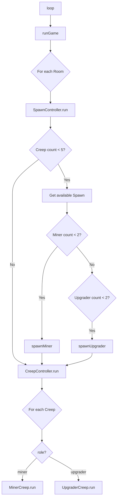
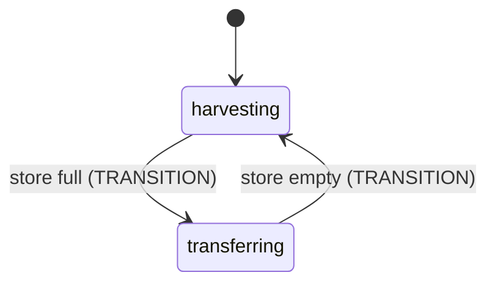
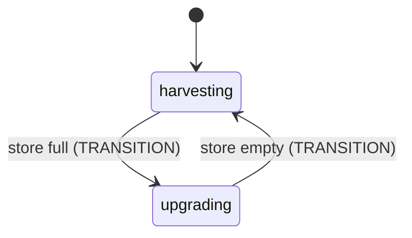
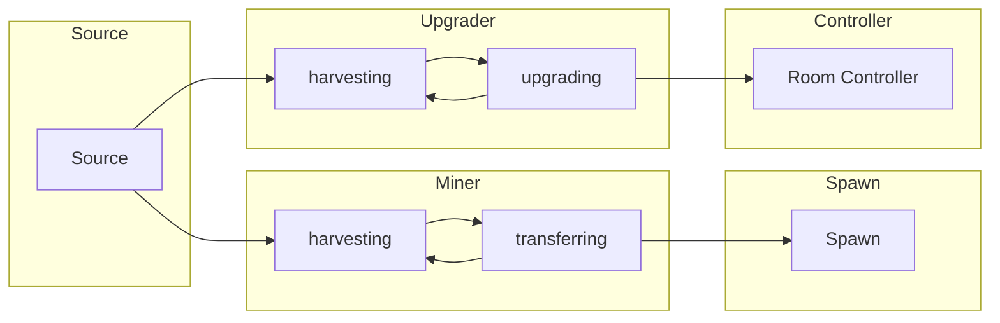

# PRD: Colony Foundation v1

**Document Version:** 1.0  
**Date:** 2026-03-10  
**Status:** Done

---

## 1. 目標與願景

### 目標

建立 Screeps 殖民地的自動化基礎系統，實現：

- **能量採集自動化**：礦工（Miner）自動採集 Source 能量並傳遞至 Spawn
- **Controller 升級自動化**：升級者（Upgrader）自動採集能量並升級 Room Controller
- **Creep 生成自動化**：根據房間內 Creep 數量與角色自動生成新單位

### 願景

- 以 TypeScript + XState 建立可擴展的架構
- 為後續擴充（Builder、Harvester、Carrier 等角色）奠定基礎
- 採用 TDD 確保程式碼品質與可維護性

---

## 2. 功能詳述

### 2.1 遊戲主迴圈 (Game Loop)

- 每 tick 執行 `loop()` → `runGame()`
- 依序處理：SpawnController（各房間）→ CreepController（全域）

### 2.2 SpawnController

| 項目 | 說明 |
|------|------|
| 職責 | 管理房間內 Creep 數量與角色比例 |
| 最大 Creep 數 | 5 |
| 最大礦工數 | 2 |
| 最大升級者數 | 2 |
| 生成優先順序 | Miner > Upgrader |
| 生成條件 | 總 Creep 數 < 5，且有 Spawn 擁有足夠能量（≥200） |

### 2.3 CreepController

| 項目 | 說明 |
|------|------|
| 職責 | 依 role 分派並執行 creep 行為 |
| 支援角色 | miner, upgrader |
| 錯誤處理 | 對無效 role 的 creep 記錄並略過 |
| 執行方式 | 每個 tick 遍歷所有 Creep，依 role 建立對應 Creep 並執行 run() |

### 2.4 Miner（礦工）

| 項目 | 說明 |
|------|------|
| 身體組成 | [WORK, CARRY, MOVE] |
| 能量成本 | 200 |
| 狀態機 | harvesting ↔ transferring |
| 行為 | 採集 Source → 滿載後傳給 Spawn |

### 2.5 Upgrader（升級者）

| 項目 | 說明 |
|------|------|
| 身體組成 | [WORK, CARRY, MOVE] |
| 能量成本 | 200 |
| 狀態機 | harvesting ↔ upgrading |
| 行為 | 採集 Source → 滿載後升級 Room Controller |

### 2.6 Creep Actions（共用動作）

- `harvestEnergy`：採集 Source 能量（目標：sources[0]）
- `transferEnergy`：將能量傳給 Spawn（目標：spawns[0]）
- `upgradeController`：升級 Room Controller

---

## 3. 業務邏輯圖

### 3.1 主流程



### 3.2 Miner 狀態機



### 3.3 Upgrader 狀態機



### 3.4 資料流



---

## 4. 參考檔案路徑

### 4.1 入口與核心

| 路徑 | 說明 |
|------|------|
| `src/main.ts` | 遊戲主入口，每 tick 呼叫 loop() |
| `src/gameRunner.ts` | 遊戲主流程，協調 SpawnController 與 CreepController |

### 4.2 Creep 相關

| 路徑 | 說明 |
|------|------|
| `src/creeps/CreepController.ts` | 依 role 分派並執行 creep |
| `src/creeps/creepActions.ts` | 採集、傳遞、升級等共用動作 |
| `src/creeps/miner/MinerCreep.ts` | 礦工 Creep 類別 |
| `src/creeps/miner/minerMachine.ts` | 礦工 XState 狀態機 |
| `src/creeps/upgrader/UpgraderCreep.ts` | 升級者 Creep 類別 |
| `src/creeps/upgrader/upgraderMachine.ts` | 升級者 XState 狀態機 |

### 4.3 建築相關

| 路徑 | 說明 |
|------|------|
| `src/structures/spawn/SpawnController.ts` | 管理房間內 Creep 生成 |
| `src/structures/spawn/Spawn.ts` | Spawn 實作，spawnMiner/spawnUpgrader |
| `src/structures/base/BaseStructure.ts` | 建築基底類別 |
| `src/structures/base/IStructure.ts` | 建築介面 |

### 4.4 型別定義

| 路徑 | 說明 |
|------|------|
| `src/types/memory.d.ts` | CreepRole、CreepState、Memory 型別 |

### 4.5 測試

| 路徑 | 說明 |
|------|------|
| `src/creeps/__tests__/creepActions.test.ts` | creepActions 單元測試 |
| `src/creeps/__tests__/CreepController.test.ts` | CreepController 單元測試 |
| `src/creeps/miner/__test__/MinerCreep.test.ts` | MinerCreep 單元測試 |
| `src/creeps/miner/__test__/minerMachine.test.ts` | minerMachine 單元測試 |
| `src/creeps/upgrader/__test__/UpgraderCreep.test.ts` | UpgraderCreep 單元測試 |
| `src/creeps/upgrader/__test__/upgraderMachine.test.ts` | upgraderMachine 單元測試 |
| `src/structures/spawn/__tests__/Spawn.test.ts` | Spawn 單元測試 |
| `src/structures/spawn/__tests__/SpawnController.test.ts` | SpawnController 單元測試 |
| `src/structures/base/__tests__/BaseStructure.test.ts` | BaseStructure 單元測試 |

---

## 5. 範例程式碼

### 5.1 主入口

```typescript
// src/main.ts
import { runGame } from '@/gameRunner';
import { log } from '@/utils/logger';

export function loop(): void {
  log('Loop started');
  runGame();
}
```

### 5.2 遊戲主流程

```typescript
// src/gameRunner.ts
export function runGame(): void {
  for (const roomName in Game.rooms) {
    const room = Game.rooms[roomName];
    const spawnController = new SpawnController(room);
    spawnController.run();
  }

  const creepController = new CreepController();
  creepController.run();
}
```

### 5.3 Creep 分派

```typescript
// src/creeps/CreepController.ts - runCreepByRole
private runCreepByRole(creep: Creep, role: CreepRole): void {
  switch (role) {
    case 'miner': {
      const minerCreep = new MinerCreep(creep);
      minerCreep.run();
      break;
    }
    case 'upgrader': {
      const upgraderCreep = new UpgraderCreep(creep);
      upgraderCreep.run();
      break;
    }
    // ...
  }
}
```

### 5.4 Spawn 生成邏輯

```typescript
// src/structures/spawn/SpawnController.ts - run
public run(): void {
  if (!this.shouldSpawnCreep()) return;
  const spawn = this.getAvailableSpawn();
  if (!spawn) return;

  const minerCount = this.countMiners();
  const upgraderCount = this.countUpgraders();

  if (minerCount < this.MAX_MINERS) {
    spawn.spawnMiner();
  } else if (upgraderCount < this.MAX_UPGRADERS) {
    spawn.spawnUpgrader();
  }
}
```

### 5.5 Miner 狀態機

```typescript
// src/creeps/miner/minerMachine.ts
states: {
  harvesting: {
    entry: ['harvest'],
    on: {
      TRANSITION: {
        target: 'transferring',
        guard: ({ context }) => context.creep.store.getFreeCapacity() === 0,
      },
    },
  },
  transferring: {
    entry: ['transfer'],
    on: {
      TRANSITION: {
        target: 'harvesting',
        guard: ({ context }) => context.creep.store.getUsedCapacity() === 0,
      },
    },
  },
}
```

### 5.6 Creep Actions

```typescript
// src/creeps/creepActions.ts
harvestEnergy: (creep: Creep) => {
  const sources = creep.room.find(FIND_SOURCES) as Source[];
  if (sources.length > 0) {
    if (creep.harvest(sources[0]) === ERR_NOT_IN_RANGE) {
      creep.moveTo(sources[0]);
    }
  }
},
```

---

## 6. 驗證項目

### 6.1 單元測試

| 驗證項目 | 測試檔案 | 說明 |
|----------|----------|------|
| creepActions.harvestEnergy | creepActions.test.ts | 採集 Source 行為 |
| creepActions.transferEnergy | creepActions.test.ts | 傳遞能量至 Spawn |
| creepActions.upgradeController | creepActions.test.ts | 升級 Controller |
| CreepController 分派 | CreepController.test.ts | 依 role 正確分派 |
| MinerCreep 執行 | MinerCreep.test.ts | Miner 狀態機執行 |
| minerMachine 狀態轉換 | minerMachine.test.ts | harvesting ↔ transferring |
| UpgraderCreep 執行 | UpgraderCreep.test.ts | Upgrader 狀態機執行 |
| upgraderMachine 狀態轉換 | upgraderMachine.test.ts | harvesting ↔ upgrading |
| Spawn 生成 | Spawn.test.ts | spawnMiner、spawnUpgrader、hasEnoughEnergy |
| SpawnController 邏輯 | SpawnController.test.ts | 生成數量與優先順序 |
| BaseStructure | BaseStructure.test.ts | getId、getPos、getRoom |

### 6.2 執行驗證

```bash
# 執行所有測試
npm test

# 執行測試並覆蓋率報告
npm run test:coverage

# 建置
npm run build

# 建置並推送至主伺服器
npm run push
```

### 6.3 遊戲內驗證

| 項目 | 預期行為 |
|------|----------|
| 遊戲啟動 | 每 tick 執行 loop，無錯誤 |
| Spawn 生成 | 總 Creep < 5 時自動生成 Miner 或 Upgrader |
| Miner 行為 | 採集 Source → 傳遞至 Spawn |
| Upgrader 行為 | 採集 Source → 升級 Room Controller |
| 能量流 | 能量從 Source 經 Miner 至 Spawn；經 Upgrader 至 Controller |

---

## Appendix: 技術棧

| 項目 | 技術 |
|------|------|
| 語言 | TypeScript |
| 建置 | Rollup |
| 狀態機 | XState v5 |
| 測試 | Jest |
| 程式碼風格 | ESLint + Prettier |
