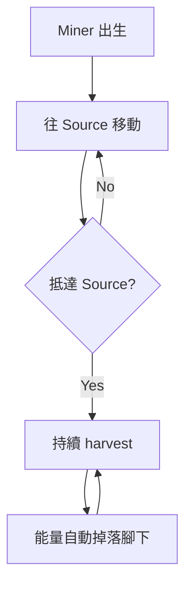
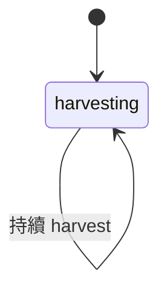
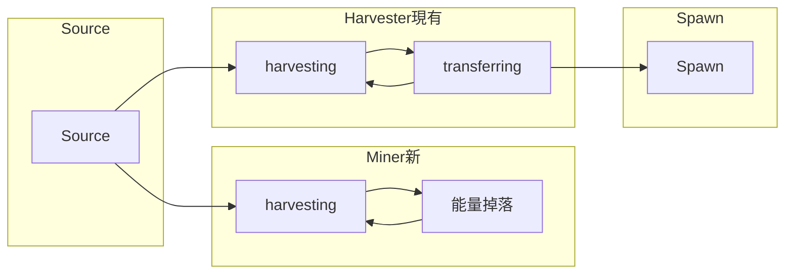

# PRD: Miner 角色（Source 專職挖礦）

**Document Version:** 1.0  
**Date:** 2026-03-13  
**Status:** Draft

---

## 1. 目標與願景

### 目標

- **新增 Miner 角色**：專職於 Source 旁挖礦，不負責搬運能量
- **簡化行為邏輯**：出生後直接前往 Source，抵達即挖礦，滿載時能量掉在地上
- **與現有 Harvester 區隔**：Harvester 採集並傳遞至 Spawn；Miner 僅挖礦並掉落

### 願景

- 建立「挖礦」與「搬運」職責分離的架構，為後續 Hauler 等角色奠定基礎
- 與現有 CreepController、Spawn 整合，保持架構一致性
- 產生的條件與數量暫以 TODO 處理，後續 PRD 再定義

---

## 2. 功能詳述

### 2.1 Miner 角色定義

| 項目 | 說明 |
|------|------|
| 身體組成 | [WORK, WORK, WORK, MOVE] |
| 能量成本 | 300（WORK×3=300 + MOVE×50=50） |
| 職責 | 僅挖礦，不搬運 |
| 行為 | 前往 Source → 抵達後持續 harvest → 滿載時能量掉在地上 |

### 2.2 行為邏輯

| 階段 | 行為 |
|------|------|
| 出生 | 直接往 Source 移動 |
| 抵達 Source | 持續 harvest，不離開 |
| 滿載 | 能量掉落在腳下（`creep.drop(RESOURCE_ENERGY)`），符合預期 |
| 無 CARRY | 無 store，harvest 產出會自動掉落在 creep 所在格 |

> **注意**：身體無 CARRY 時，`creep.store` 容量為 0，harvest 產出會直接掉落在 creep 所在位置，無需額外 `drop` 邏輯。

### 2.3 與現有角色對照

| 角色 | 身體 | 職責 | 狀態機 |
|------|------|------|--------|
| Harvester（現有 Miner） | [WORK, CARRY, MOVE] | 採集 → 傳遞至 Spawn | harvesting ↔ transferring |
| **Miner（新）** | [WORK, WORK, WORK, MOVE] | 僅挖礦，能量掉地上 | 單一狀態：harvesting |

### 2.4 產生條件與數量

- **TODO**：產生的條件和數量之後再處理
- 本 PRD 僅實作 Miner 行為，SpawnController 整合留待後續

---

## 3. 業務邏輯圖

### 3.1 Miner 主流程



### 3.2 Miner 狀態機（簡化）



> 無需 transferring 狀態，因無 CARRY 且能量自動掉落。

### 3.3 與 Harvester 職責分離



---

## 4. 參考檔案路徑

| 路徑 | 說明 |
|------|------|
| `src/creeps/CreepController.ts` | 需新增 Miner 分派 |
| `src/creeps/miner/MinerCreep.ts` | 現有 Miner 為 Harvester 邏輯，需新增 SourceMinerCreep 或重構 |
| `src/creeps/miner/minerMachine.ts` | 現有 harvesting↔transferring，新 Miner 僅需 harvesting |
| `src/creeps/creepActions.ts` | harvestEnergy 可共用 |
| `src/types/memory.d.ts` | 需新增 CreepRole.SOURCE_MINER 或調整 Miner 定義 |
| `src/structures/spawn/Spawn.ts` | TODO：spawnMiner 改為 spawnSourceMiner 或新增方法 |
| `src/structures/spawn/SpawnController.ts` | TODO：產生條件與數量 |
| `docs/prd/done/colony-foundation-v1_20260310.md` | 現況基準 |
| `docs/prd/done/creep-level-spawn-rcl2_20260310.md` | Harvester 對應現有 Miner |

---

## 5. 範例程式碼

### 5.1 新增 SourceMinerCreep（建議獨立檔案）

```typescript
// src/creeps/sourceMiner/SourceMinerCreep.ts
import { createActor } from 'xstate';
import { createSourceMinerMachine } from '@/creeps/sourceMiner/sourceMinerMachine';

export class SourceMinerCreep {
  private creep: Creep;
  private actor: ReturnType<typeof createActor>;

  constructor(creep: Creep) {
    this.creep = creep;
    const machine = createSourceMinerMachine(this.creep);
    this.actor = createActor(machine, { systemId: `sourceMiner-${this.creep.name}` });
    this.actor.start();
  }

  public run(): void {
    this.actor.send({ type: 'TICK' });
  }
}
```

### 5.2 SourceMiner 狀態機（單一狀態）

```typescript
// src/creeps/sourceMiner/sourceMinerMachine.ts
import { createMachine } from 'xstate';
import { creepActions } from '@/creeps/creepActions';

interface SourceMinerContext {
  creep: Creep;
}

export const createSourceMinerMachine = (creep: Creep) =>
  createMachine(
    {
      id: 'sourceMiner',
      initial: 'harvesting',
      context: { creep },
      schemas: {
        context: {} as SourceMinerContext,
        events: {} as { type: 'TICK' },
      },
      states: {
        harvesting: {
          entry: ['harvest'],
          // 無需 TRANSITION，持續 harvest
        },
      },
    },
    {
      actions: {
        harvest: ({ context }: { context: SourceMinerContext }) => {
          creepActions.harvestEnergy(context.creep);
        },
      },
    }
  );
```

### 5.3 CreepRole 與 Spawn Body

```typescript
// src/types/memory.d.ts - 新增
SOURCE_MINER = 'sourceMiner',

// src/structures/spawn/Spawn.ts - 新增
private readonly SOURCE_MINER_BODY = [WORK, WORK, WORK, MOVE];

public spawnSourceMiner(): ScreepsReturnCode {
  return this.spawn.spawnCreep(this.SOURCE_MINER_BODY, `SourceMiner_${Game.time}`, {
    memory: {
      role: CreepRole.SOURCE_MINER,
      state: CreepState.HARVESTING,
    },
  });
}
```

### 5.4 CreepController 分派

```typescript
// src/creeps/CreepController.ts - runCreepByRole 新增
case 'sourceMiner': {
  const sourceMinerCreep = new SourceMinerCreep(creep);
  sourceMinerCreep.run();
  break;
}
```

---

## 6. 驗證項目

### 6.1 單元測試

| 驗證項目 | 測試檔案 | 說明 |
|----------|----------|------|
| SourceMinerCreep 執行 | SourceMinerCreep.test.ts | 呼叫 harvestEnergy |
| sourceMinerMachine 單一狀態 | sourceMinerMachine.test.ts | 僅 harvesting |
| CreepController 分派 sourceMiner | CreepController.test.ts | 依 role 正確分派 |
| harvestEnergy 行為 | creepActions.test.ts | 採集 Source（可沿用現有） |

### 6.2 執行驗證

`npm test`、`npm run build`

### 6.3 遊戲內驗證

| 項目 | 預期行為 |
|------|----------|
| Miner 出生 | 直接往 Source 移動 |
| Miner 抵達 Source | 持續 harvest，不離開 |
| Miner 滿載 | 能量掉落在腳下（無 CARRY 時自動掉落） |
| 不影響 Harvester | 現有 harvest→transfer 流程正常 |

---

## 7. 開發任務清單 (TODO)

每項任務 ≤ 1 天（約 4–6 小時），依賴欄位標註前置任務編號。

| # | 任務 | 預估 | 依賴 | 驗證 |
|---|------|------|------|------|
| 1 | 型別：CreepRole.SOURCE_MINER、SourceMinerMemory | 1h | - | memory.d.ts 有定義、`npm run build` 通過 |
| 2 | sourceMinerMachine + SourceMinerCreep | 3h | 1 | 6.1 SourceMinerCreep、sourceMinerMachine 單元測試 |
| 3 | CreepController 分派 + Spawn.spawnSourceMiner | 2h | 2 | 6.1 CreepController 分派、spawnSourceMiner 方法 |
| 4 | 單元測試補齊與整合驗證 | 2h | 3 | `npm test`、`npm run build`、6.3 遊戲內驗證 |

**建議順序**：依表格由上而下執行，先完成無依賴的基礎任務。

---

## Appendix: 術語對照

| Raw 需求 | 程式碼對應 |
|----------|------------|
| Miner 角色 | CreepRole.SOURCE_MINER |
| 身體 [WORK, WORK, WORK, MOVE] | SOURCE_MINER_BODY |
| 挖礦、能量掉地上 | harvestEnergy + 無 CARRY（自動掉落） |
| 產生的條件和數量 | TODO，後續 PRD |
