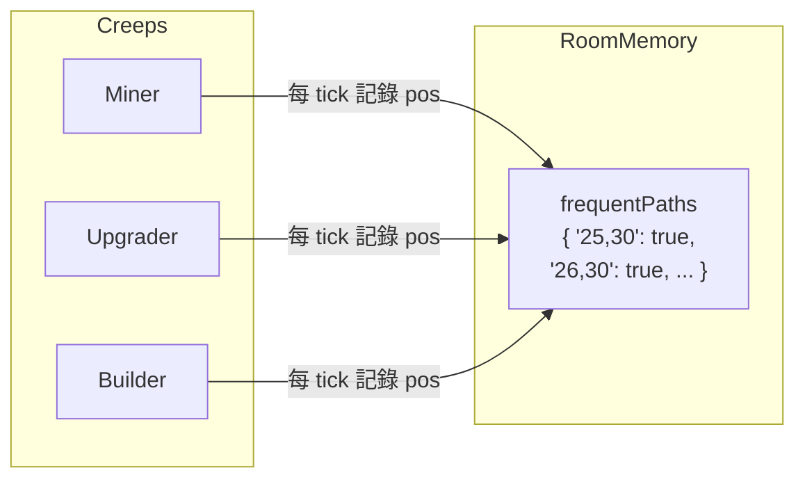

# PRD: 常走路徑紀錄 (Path Memory)

**Document Version:** 1.0  
**Date:** 2026-03-10  
**Status:** Draft

---

## 1. 目標與願景

### 目標

- **Room Memory 擴充**：新增「常走的路徑」屬性，紀錄 RCL ≤ 2 時 Creep 走過的位置
- **路徑紀錄邏輯**：每次 Creep 行動前，將當前 (x, y) 記錄至常走路徑；若該座標已有資料則跳過
- **為道路建造鋪路**：此路徑資料供後續 PRD（道路建造）使用，於常走路徑上鋪設道路

### 願景

- 利用 Screeps `room.memory` 可自訂屬性的特性，儲存 JSON 可序列化資料
- 僅在 RCL ≤ 2 時紀錄，避免後期路徑資料過大

---

## 2. 功能詳述

### 2.1 Room Memory 結構

| 項目 | 說明 |
|------|------|
| 屬性名稱 | `frequentPaths`（常走的路徑） |
| 資料型別 | `Record<string, true>` 或 `Set<string>` 的序列化形式 |
| Key 格式 | `"x,y"`（例如 `"25,30"`） |
| Value | 存在即表示該座標曾被走過 |
| 初始化 | 首次使用時 `room.memory.frequentPaths = room.memory.frequentPaths ?? {}` |

> **Screeps 限制**：Memory 僅能儲存 JSON 可序列化資料，不可儲存 Game 物件。座標以字串 `"x,y"` 儲存。

### 2.2 紀錄時機與條件

| 項目 | 說明 |
|------|------|
| 觸發時機 | 每次 Creep 執行 `run()` 前（或 `moveTo` 之後） |
| 條件 | `room.controller?.level <= 2` |
| 紀錄內容 | `creep.pos.x`, `creep.pos.y` |
| 去重 | 若 `frequentPaths["x,y"]` 已存在，則跳過 |

### 2.3 紀錄流程

1. Creep 進入 `run()` 或行動前
2. 檢查 `room.controller.level <= 2`
3. 取得 `creep.pos.x`, `creep.pos.y`
4. 若 `room.memory.frequentPaths["x,y"]` 未定義，則 `room.memory.frequentPaths["x,y"] = true`
5. 繼續執行 Creep 原本行為

### 2.4 型別定義

```typescript
// RoomMemory 需新增
interface RoomMemory {
  frequentPaths?: Record<string, boolean>;
}
```

---

## 3. 業務邏輯圖

### 3.1 路徑紀錄流程

```mermaid
flowchart TD
    A[Creep 行動前] --> B{RCL <= 2?}
    B -->|No| C[跳過紀錄]
    B -->|Yes| D[取得 creep.pos.x, creep.pos.y]
    D --> E[key = "x,y"]
    E --> F{frequentPaths[key] 存在?}
    F -->|Yes| G[跳過]
    F -->|No| H[frequentPaths[key] = true]
    G --> I[執行 Creep 行為]
    H --> I
    C --> I
```

### 3.2 資料流



---

## 4. 參考檔案路徑

| 路徑 | 說明 |
|------|------|
| `src/types/memory.d.ts` | 需新增 `RoomMemory` 介面與 `frequentPaths` |
| `src/creeps/creepActions.ts` | 或新建 `pathRecord.ts` 共用邏輯 |
| `src/creeps/CreepController.ts` | 需在執行 Creep 前呼叫路徑紀錄 |
| `src/creeps/miner/MinerCreep.ts` | 或於各 Creep 內部呼叫 |
| `docs/prd/done/colony-foundation-v1_20260310.md` | 現況基準 |

---

## 5. 範例程式碼

### 5.1 路徑紀錄函式

```typescript
// src/utils/pathRecord.ts (新建)
export function recordFrequentPath(creep: Creep): void {
  const room = creep.room;
  const controller = room.controller;
  if (!controller || controller.level > 2) return;

  if (!room.memory.frequentPaths) {
    room.memory.frequentPaths = {};
  }

  const key = `${creep.pos.x},${creep.pos.y}`;
  if (room.memory.frequentPaths[key] === undefined) {
    room.memory.frequentPaths[key] = true;
  }
}
```

### 5.2 CreepController 整合

```typescript
// src/creeps/CreepController.ts - run()
public run(): void {
  for (const name in this.creeps) {
    const creep = this.creeps[name];
    recordFrequentPath(creep);  // 行動前紀錄路徑
    // ... 原有 runCreepByRole 邏輯
  }
}
```

### 5.3 RoomMemory 型別

```typescript
// src/types/memory.d.ts
interface RoomMemory {
  frequentPaths?: Record<string, boolean>;
}
```

---

## 6. 驗證項目

### 6.1 單元測試

| 驗證項目 | 測試檔案 | 說明 |
|----------|----------|------|
| recordFrequentPath RCL 1 | pathRecord.test.ts | 記錄座標至 frequentPaths |
| recordFrequentPath RCL 3 | pathRecord.test.ts | 不記錄 |
| recordFrequentPath 重複座標 | pathRecord.test.ts | 不覆寫、不重複 |
| recordFrequentPath 初始化 | pathRecord.test.ts | 自動建立 frequentPaths 物件 |

### 6.2 執行驗證

`npm test`、`npm run build`

### 6.3 遊戲內驗證

| 項目 | 預期行為 |
|------|----------|
| RCL 1~2 Creep 移動 | `room.memory.frequentPaths` 隨 Creep 移動逐漸累積座標 |
| RCL 3+ | 不再記錄新座標 |
| 重訪同一格 | 座標已存在，不重複寫入 |

---

## Appendix: 注意事項

- **Room Memory 確認**：Screeps 支援 `room.memory`（即 `Memory.rooms[roomName]`）自訂屬性，可直接使用
- **Memory 大小**：RCL ≤ 2 時路徑較短，資料量可控；若後續需擴充，可考慮定期清理或壓縮
