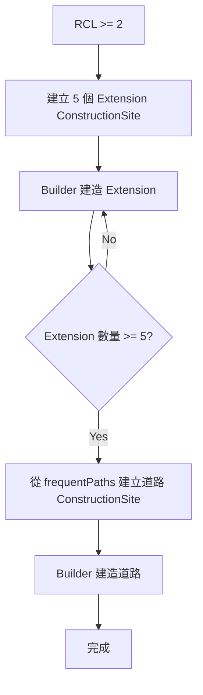
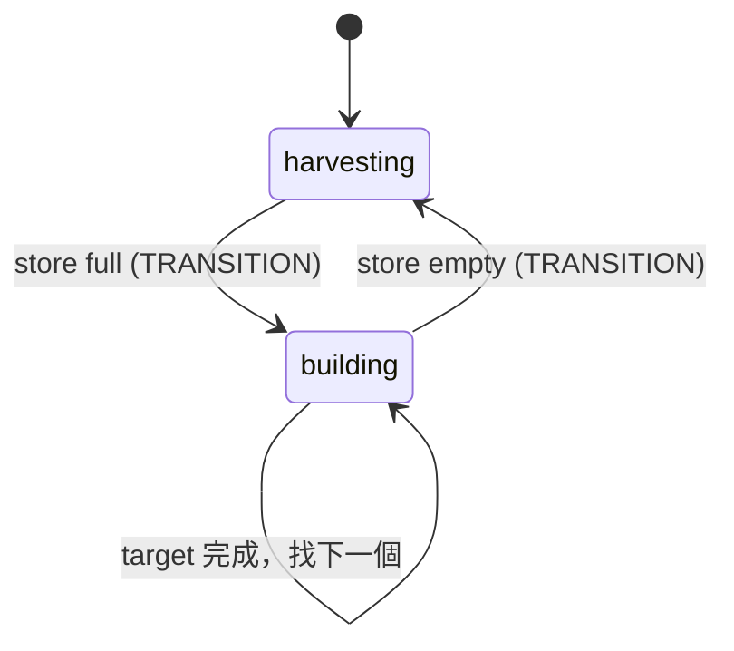
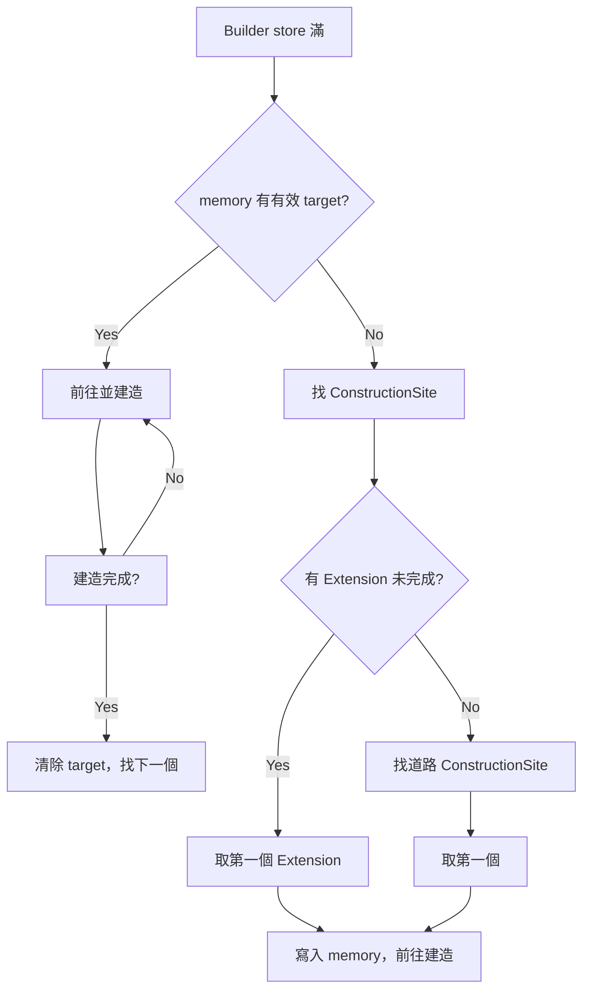
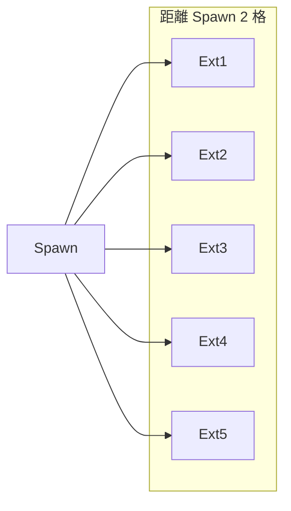

# PRD: RCL2 擴張 - Extension、Builder、道路建造

**Document Version:** 1.0  
**Date:** 2026-03-10  
**Status:** Draft

---

## 1. 目標與願景

### 目標

- **RCL 2 Extension 建造**：RCL 2 時建造 5 個 Extension，位置在 Spawn 附近，與 Spawn 距離兩格，Extension 之間空一格
- **Builder 角色**：Body `[WORK, CARRY, MOVE]`，負責挖礦與蓋建築；Memory 紀錄目前在蓋的建築
- **道路建造**：5 個 Extension 蓋好後，將「常走路徑」每個座標鋪上道路；Builder 確認 Extension 都蓋好後開始蓋道路

### 願景

- 建立 Construction 規劃與執行流程，與 Path Memory、Spawn 數量整合
- Builder 採「血量最低優先」策略，完成後自動找下一個目標

---

## 2. 功能詳述

### 2.1 Extension 建造規劃

| 項目 | 說明 |
|------|------|
| 觸發條件 | `room.controller?.level >= 2` |
| 數量 | 5 個 |
| 位置規則 | 在 Spawn 附近，與 Spawn 距離兩格 |
| 間距 | 每個 Extension 之間空一格 |
| 實作方式 | 使用 `room.createConstructionSite(x, y, STRUCTURE_EXTENSION)` |

#### 位置計算範例

- Spawn 座標為 (25, 30)
- 與 Spawn 距離兩格：例如 (23, 30), (27, 30), (25, 28), (25, 32) 等
- Extension 之間空一格：選定 5 個不重複且符合條件的座標

### 2.2 Builder 角色

| 項目 | 說明 |
|------|------|
| Body | [WORK, CARRY, MOVE] |
| 能量成本 | 200 |
| 職責 | 1. 挖礦（採集能量） 2. 蓋建築 |
| 狀態機 | harvesting ↔ building |

### 2.3 Builder Memory

| 項目 | 說明 |
|------|------|
| 屬性 | `buildingTargetId?: Id<ConstructionSite>` 或 `Id<Structure>` |
| 出生時 | 找到當前血量最低的建築陣列，取第一個，寫入 memory |
| 完成時 | 建築完成後，再找下一個血量最低的建築，更新 memory |
| 建築類型 | ConstructionSite（建造中）或 Structure（維修中，若未來擴充） |

#### 血量最低的建築

- **ConstructionSite**：無 `hits`，可視為「待建造」優先
- **Structure**：`structure.hits / structure.hitsMax` 最低者優先
- 實作時：先找 `FIND_CONSTRUCTION_SITES`，再找 `FIND_STRUCTURES` 需維修者，依血量排序取第一個

### 2.4 Builder 行為流程

1. 若 store 空 → harvesting（採集 Source）
2. 若 store 滿 → building
   - 若 memory 無 target 或 target 已失效 → 找血量最低的建築，寫入 memory
   - 若有 target → 前往並建造/維修

### 2.5 道路建造

| 項目 | 說明 |
|------|------|
| 觸發條件 | 5 個 Extension 都蓋好（`room.find(FIND_MY_STRUCTURES, { filter: { structureType: STRUCTURE_EXTENSION } }).length >= 5`） |
| 資料來源 | `room.memory.frequentPaths`（常走路徑） |
| 行為 | 將每個座標建立 `ConstructionSite(x, y, STRUCTURE_ROAD)` |
| 執行者 | Builder（在 Extension 都蓋好後，開始找道路 ConstructionSite 來蓋） |

#### 道路建造流程

1. 某模組（如 RoomPlanner 或 gameRunner）檢查：Extension 數量 >= 5
2. 遍歷 `room.memory.frequentPaths`，對每個座標呼叫 `room.createConstructionSite(x, y, STRUCTURE_ROAD)`
3. 注意：需排除已有建築的座標、Spawn 座標等
4. Builder 會自動找到這些道路 ConstructionSite（因血量/建造進度邏輯可擴充為「道路優先」或「依距離」）

#### Builder 建造優先順序（建議）

1. Extension ConstructionSite（RCL 2 時）
2. 道路 ConstructionSite（Extension 蓋好後）
3. 未來可擴充：維修低血量建築

---

## 3. 業務邏輯圖

### 3.1 RCL2 擴張主流程



### 3.2 Builder 狀態機



### 3.3 Builder 目標選擇



### 3.4 Extension 位置示意



> 實際座標需依地形、可行走格計算，Extension 之間空一格。

---

## 4. 參考檔案路徑

| 路徑 | 說明 |
|------|------|
| `src/structures/spawn/SpawnController.ts` | Builder 生產條件（Extension 存在） |
| `src/structures/spawn/Spawn.ts` | spawnBuilder |
| `src/creeps/builder/BuilderCreep.ts` | 新建 |
| `src/creeps/builder/builderMachine.ts` | 新建，XState 狀態機 |
| `src/creeps/creepActions.ts` | 擴充 build、repair 等 |
| `src/structures/room/RoomPlanner.ts` | 新建，Extension 位置規劃、道路 ConstructionSite 建立 |
| `src/types/memory.d.ts` | BuilderMemory |
| `docs/prd/path-memory_20260310.md` | 常走路徑資料來源 |
| `docs/prd/creep-level-spawn-rcl2_20260310.md` | Builder 數量與生產條件 |

---

## 5. 範例程式碼

### 5.1 Extension 位置規劃

```typescript
// src/structures/room/RoomPlanner.ts (新建)
export function planExtensions(room: Room, spawn: StructureSpawn): { x: number; y: number }[] {
  const spawnPos = spawn.pos;
  const candidates: { x: number; y: number }[] = [];
  const distance = 2;

  for (let dx = -distance; dx <= distance; dx++) {
    for (let dy = -distance; dy <= distance; dy++) {
      if (dx === 0 && dy === 0) continue;
      const x = spawnPos.x + dx;
      const y = spawnPos.y + dy;
      if (room.getTerrain().get(x, y) !== TERRAIN_MASK_WALL) {
        candidates.push({ x, y });
      }
    }
  }
  // 選 5 個，且彼此距離至少 2 格（中間空一格）
  return selectExtensionPositions(candidates, 5);
}
```

### 5.2 道路 ConstructionSite 建立

```typescript
// src/structures/room/RoomPlanner.ts
export function createRoadConstructionSites(room: Room): void {
  const paths = room.memory.frequentPaths;
  if (!paths) return;

  const spawn = room.find(FIND_MY_SPAWNS)[0];
  if (!spawn) return;

  for (const key of Object.keys(paths)) {
    const [x, y] = key.split(',').map(Number);
    const pos = new RoomPosition(x, y, room.name);
    const existing = pos.lookFor(LOOK_STRUCTURES).length + pos.lookFor(LOOK_CONSTRUCTION_SITES).length;
    if (existing === 0) {
      room.createConstructionSite(x, y, STRUCTURE_ROAD);
    }
  }
}
```

### 5.3 Builder 目標選擇

```typescript
// src/creeps/builder/BuilderCreep.ts 或 builderActions
function getNextBuildTarget(creep: Creep): ConstructionSite | null {
  const sites = creep.room.find(FIND_CONSTRUCTION_SITES);
  if (sites.length === 0) return null;
  // 優先 Extension，再道路
  const extensions = sites.filter(s => s.structureType === STRUCTURE_EXTENSION);
  const roads = sites.filter(s => s.structureType === STRUCTURE_ROAD);
  const ordered = [...extensions, ...roads];
  return ordered[0] ?? null;
}
```

### 5.4 Builder Memory

```typescript
// src/types/memory.d.ts
interface BuilderMemory extends CreepMemory {
  role: CreepRole.BUILDER;
  buildingTargetId?: Id<ConstructionSite>;
}
```

---

## 6. 驗證項目

### 6.1 單元測試

| 驗證項目 | 測試檔案 | 說明 |
|----------|----------|------|
| planExtensions | RoomPlanner.test.ts | 回傳 5 個合法座標，與 Spawn 距離 2 |
| createRoadConstructionSites | RoomPlanner.test.ts | 依 frequentPaths 建立 ConstructionSite |
| BuilderCreep 狀態轉換 | BuilderCreep.test.ts | harvesting ↔ building |
| getNextBuildTarget | builderActions.test.ts | Extension 優先於道路 |
| Builder 完成後找下一個 | BuilderCreep.test.ts | target 完成後更新 memory |

### 6.2 執行驗證

`npm test`、`npm run build`、`npm run push`

### 6.3 遊戲內驗證

| 項目 | 預期行為 |
|------|----------|
| RCL 2 | 建立 5 個 Extension ConstructionSite |
| Builder 建造 | 依序建造 Extension |
| Extension 完成 | 開始建立道路 ConstructionSite |
| 道路建造 | Builder 在常走路徑上蓋道路 |
| Builder 挖礦 | store 空時採集 Source |

---

## Appendix: 相依 PRD

| PRD | 相依關係 |
|-----|----------|
| creep-level-spawn-rcl2 | Builder 生產條件、數量 |
| path-memory | 道路建造的座標來源 |

建議實作順序：Path Memory → Creep Level Spawn → RCL2 Extension Builder Roads
